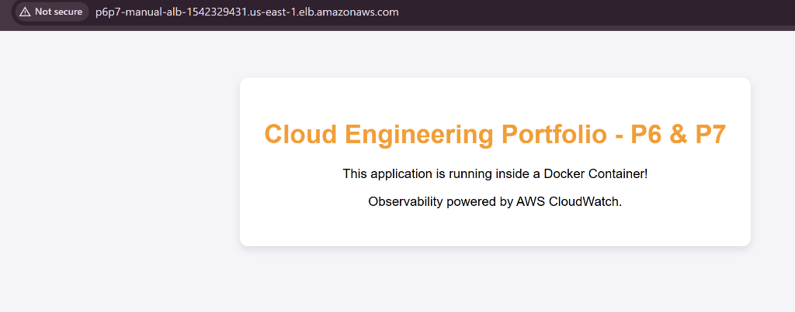

# Serverless Container Deployment on AWS ECS Fargate

## Executive Summary
This repository contains the Infrastructure as Code (IaC) required to deploy a highly available, secure, and fully serverless containerized web application on AWS. 

By leveraging AWS ECS Fargate, this architecture removes the operational overhead of provisioning, patching, and managing underlying EC2 instances. The deployment is fully codified using Terraform, ensuring repeatable, idempotent, and version-controlled infrastructure.

## Architecture Deep Dive


### Network Topology
*   **VPC & Subnets**: A custom Virtual Private Cloud (VPC) spanning two Availability Zones to ensure fault tolerance.
*   **Internet Gateway**: Attached to the VPC to allow ingress traffic from the public internet.
*   **Application Load Balancer (ALB)**: Situated in the public subnets, the ALB serves as the single point of entry, distributing incoming HTTP traffic across the container replicas.

### Compute Layer (Serverless)
*   **AWS ECS Fargate**: The container orchestrator. We define a Task Definition that allocates 256 CPU units and 512MB of memory per task. 
*   **Amazon ECR**: A private Elastic Container Registry securely stores the custom Docker image. The Fargate tasks are authenticated via an IAM Execution Role to pull this image during initialization.

### Zero-Trust Security Configuration
Security is enforced at the network interface level using AWS Security Groups:
*   **ALB Security Group**: Configured to accept `HTTP (Port 80)` traffic from the public internet (`0.0.0.0/0`).
*   **ECS Task Security Group**: Operates on a principle of least privilege. It explicitly drops all direct internet traffic. The ingress rule *only* permits `HTTP (Port 80)` traffic originating from the ALB Security Group ID.

## Technology Stack
*   **Cloud Provider**: Amazon Web Services (AWS)
*   **Infrastructure as Code**: Terraform
*   **Containerization**: Docker
*   **Compute**: AWS ECS Fargate
*   **Load Balancing**: AWS Application Load Balancer (ALB)
*   **Container Registry**: Amazon Elastic Container Registry (ECR)

## Repository File Structure
```text
.
├── Dockerfile             # Defines the custom Nginx web application
├── index.html             # The static web content served by the container
├── providers.tf           # AWS provider configuration and region selection
├── local.tf               # Global tagging and naming prefix variables
├── vpc.tf                 # Network infrastructure (VPC, Subnets, IGW, Route Tables)
├── security.tf            # Security Group definitions for ALB and ECS tasks
├── iam.tf                 # Identity and Access Management roles (ECS Execution Role)
├── ecr.tf                 # Private Docker container registry definition
├── alb.tf                 # Load Balancer, Listener, and Target Group configuration
└── ecs.tf                 # ECS Cluster, Task Definition, and Fargate Service
```

## Local Deployment Guide

### Prerequisites
1. AWS CLI installed and configured with Administrator credentials.
2. Terraform installed (v1.0+).
3. Docker installed and the daemon running locally.

### Step 1: Provision the Container Registry (ECR)
ECS tasks will fail to start if the referenced Docker image does not exist. We must deploy the ECR repository first.
```bash
terraform init
terraform apply -target=aws_ecr_repository.app_repo
```

### Step 2: Build and Push the Docker Image
Authenticate your local Docker client with AWS, build the image, and push it to the newly created ECR repository.
```powershell
# Authenticate Docker to ECR
$pass = aws ecr get-login-password --region us-east-1
docker login --username AWS --password $pass <YOUR_ACCOUNT_ID>.dkr.ecr.us-east-1.amazonaws.com

# Build the local image
docker build -t p6p7-ce-app-repo .

# Tag for ECR
docker tag p6p7-ce-app-repo:latest <YOUR_ACCOUNT_ID>.dkr.ecr.us-east-1.amazonaws.com/p6p7-ce-app-repo:latest

# Push to ECR
docker push <YOUR_ACCOUNT_ID>.dkr.ecr.us-east-1.amazonaws.com/p6p7-ce-app-repo:latest
```

### Step 3: Deploy the Infrastructure
With the image staged in ECR, apply the remaining Terraform configuration to provision the VPC, Load Balancer, and Fargate cluster.
```bash
terraform apply
```

### Validation
Navigate to the AWS Console, locate your Application Load Balancer, and copy its DNS name into your browser. You should see the application serving traffic dynamically.



## Production Considerations & Trade-offs
*   **Public vs. Private Subnets**: In this deployment, the Fargate tasks are placed in public subnets and assigned public IPs to allow them to reach out to ECR and pull the Docker image. In a strict enterprise production environment, these tasks would be placed in isolated Private Subnets, utilizing a NAT Gateway or VPC Endpoints (PrivateLink) for outbound ECR communication. This was omitted here to optimize for cost during development.

## Teardown
To prevent ongoing AWS charges for the Application Load Balancer and Fargate tasks, ensure you destroy the environment when testing is complete:
```bash
terraform destroy
```
