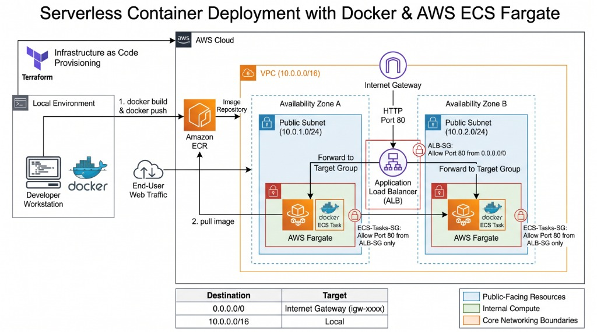

# Project 6: Serverless Container Deployment with AWS ECS Fargate

This project demonstrates a fully functional, highly available web application deployed as a Docker container on AWS ECS Fargate. The infrastructure is provisioned using Terraform, emphasizing a serverless compute model that eliminates the need to manage underlying EC2 instances.

## Architecture



The infrastructure consists of a custom Virtual Private Cloud (VPC) spanning two Availability Zones. An Internet Gateway provides public access to the Application Load Balancer (ALB) situated in the public subnets. The ECS Fargate tasks are also deployed in the public subnets, pulling the custom Docker image from a private Amazon Elastic Container Registry (ECR). Traffic routing and security are strictly controlled via Security Groups, ensuring the containers only accept HTTP traffic originating from the ALB.

## Key Features

*   Serverless Compute: Utilizes AWS Fargate to run containers without managing servers or clusters of Amazon EC2 instances
*   Infrastructure as Code: Entire infrastructure, including networking, security, load balancing, and container orchestration, is defined and provisioned using Terraform
*   Custom Containerization: A custom web application is packaged into a Docker image and securely stored in an AWS ECR private repository
*   High Availability: The ECS Service is configured to maintain multiple container replicas across different Availability Zones, balancing traffic via an ALB
*   Zero-Trust Networking: Security Groups are configured so containers explicitly drop direct internet traffic, only trusting connections forwarded by the ALB

## File Structure

*   `Dockerfile` / `index.html`: Source files for the custom Nginx web application container.
*   `providers.tf`: Terraform configuration specifying the AWS provider and region.
*   `local.tf`: Local variables used for consistent naming conventions across resources.
*   `vpc.tf`: Defines the network topology (VPC, Subnets, Internet Gateway, Route Tables).
*   `security.tf`: Defines the Security Groups for the ALB and ECS Tasks.
*   `iam.tf`: Defines the IAM Execution Role required by Fargate to pull images and write logs.
*   `ecr.tf`: Provisions the private container registry.
*   `alb.tf`: Provisions the Application Load Balancer, Target Group, and Listeners.
*   `ecs.tf`: Provisions the ECS Cluster, Task Definition, and Service.

## Prerequisites

To deploy this project, you need:
*   An active AWS Account
*   AWS CLI installed and authenticated
*   Terraform installed
*   Docker Desktop installed and running

## Deployment Steps

1.  Initialize Terraform
    ```bash
    terraform init
    ```

2.  Provision the ECR Repository First
    ```bash
    terraform apply -target=aws_ecr_repository.app_repo
    ```

3.  Authenticate Docker and Push Image
    ```bash
    $pass = aws ecr get-login-password --region us-east-1
    docker login --username AWS --password $pass <YOUR_AWS_ACCOUNT_ID>.dkr.ecr.us-east-1.amazonaws.com
    docker build -t p6p7-ce-app-repo .
    docker tag p6p7-ce-app-repo:latest <YOUR_AWS_ACCOUNT_ID>.dkr.ecr.us-east-1.amazonaws.com/p6p7-ce-app-repo:latest
    docker push <YOUR_AWS_ACCOUNT_ID>.dkr.ecr.us-east-1.amazonaws.com/p6p7-ce-app-repo:latest
    ```

4.  Provision the Remaining Infrastructure
    ```bash
    terraform apply
    ```

## Working Application


## Cleanup

To avoid incurring ongoing charges for the Application Load Balancer and running Fargate tasks, destroy the infrastructure when finished.
    ```bash
    terraform destroy
    ```
